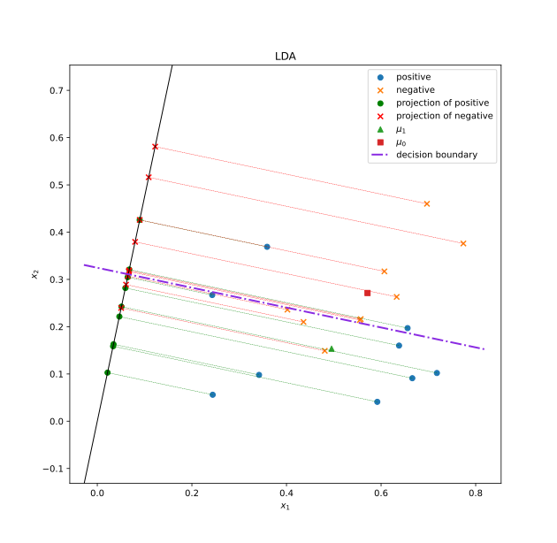

# LDA
## Question
Please implement Linear Discriminant Analysis (LDA) using Python programming and provide the results and explanations on the following dataset.

| Number | Attribute 1 | Attribute 2 | Category |
|-------:|:-----------:|:-----------:|:--------:|
|      1 |    0.666    |    0.091    | Positive |
|      2 |    0.243    |    0.267    | Positive |
|      3 |    0.244    |    0.056    | Positive |
|      4 |    0.342    |    0.098    | Positive |
|      5 |    0.638    |    0.16     | Positive |
|      6 |    0.656    |    0.197    | Positive |
|      7 |    0.359    |    0.369    | Positive |
|      8 |    0.592    |    0.041    | Positive |
|      9 |    0.718    |    0.102    | Positive |
|     10 |    0.697    |    0.460    | Negative |
|     11 |    0.774    |    0.376    | Negative |
|     12 |    0.633    |    0.263    | Negative |
|     13 |    0.607    |    0.317    | Negative |
|     14 |    0.555    |    0.214    | Negative |
|     15 |    0.402    |    0.236    | Negative |
|     16 |    0.481    |    0.149    | Negative |
|     17 |    0.436    |    0.21     | Negative |
|     18 |    0.557    |    0.216    | Negative |

## Answer
