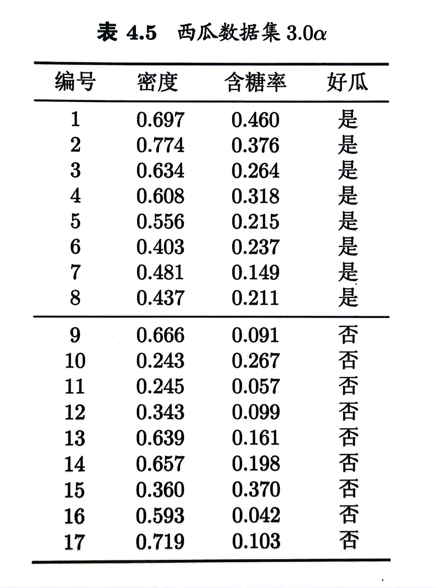
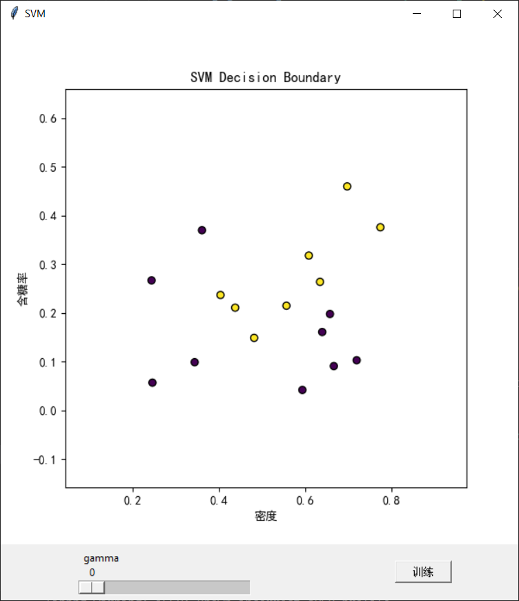
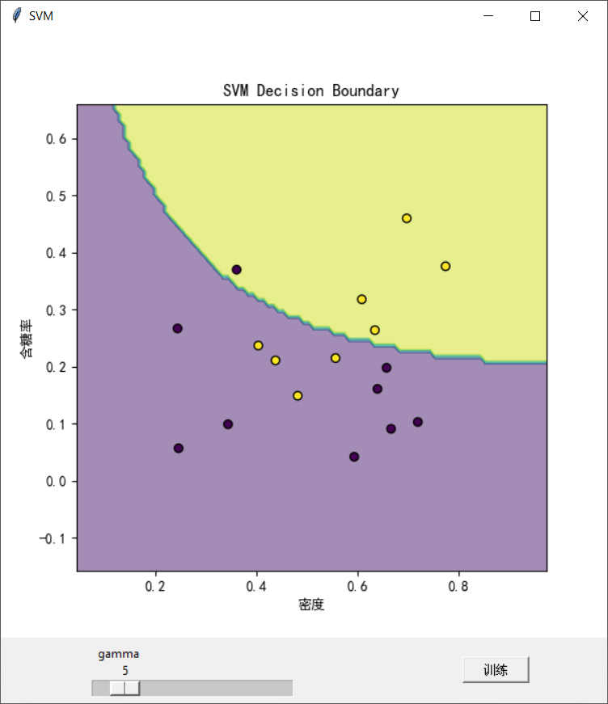
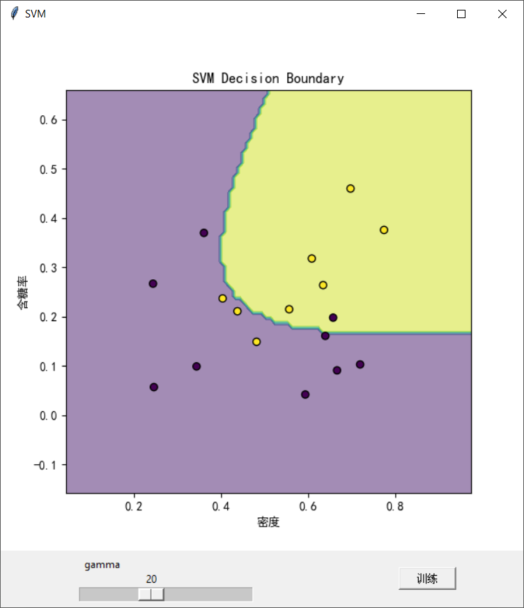
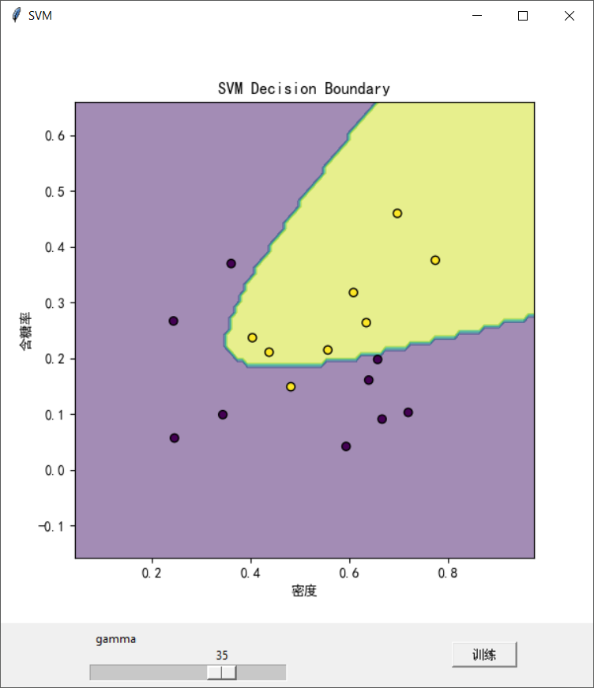
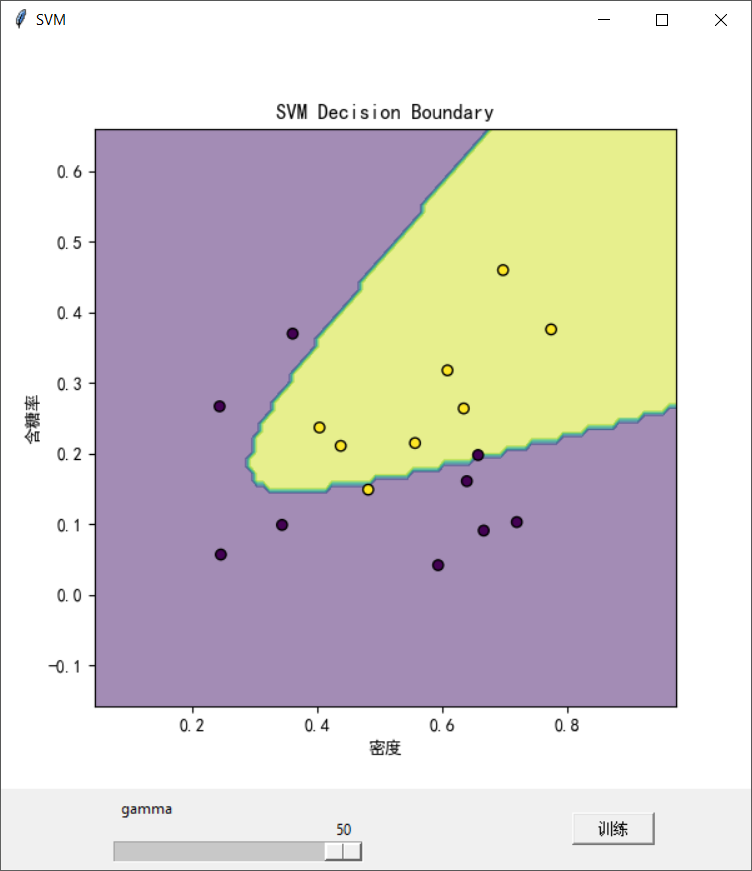

# Decision Tree
## Question
试使用[LIBSVM](https://www.csie.ntu.edu.tw/~cjlin/libsvm/)，在西瓜数据集 $3.0α$ 上分别用不同 $γ$ 参数的2次多项式核 $K(x_i, x_j)=(γ\cdot x_i\cdot x_j)^2$ 训练一个SVM，比较他们支持向量的差别，最后推荐一个合适的γ参数并说明理由。



## Answer






## Appendix
This subproject is based on the [LIBSVM](https://www.csie.ntu.edu.tw/~cjlin/libsvm/) library. To install the library, you can use the following command:

```bash
pip install -U libsvm-official
```

Then you can import the library in your code:

```python
from libsvm.svmutil import *
```