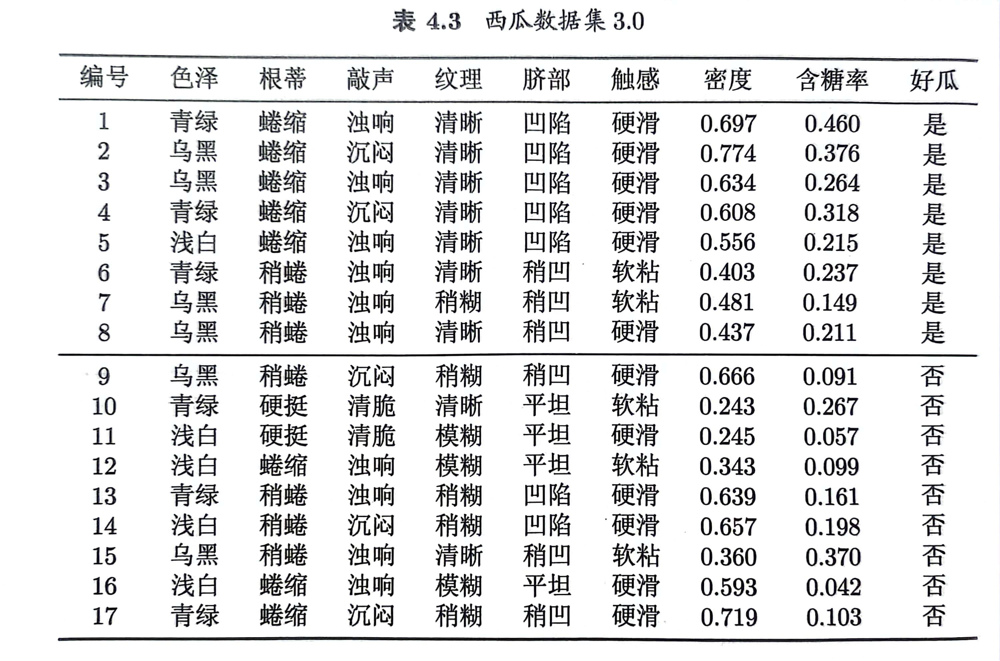
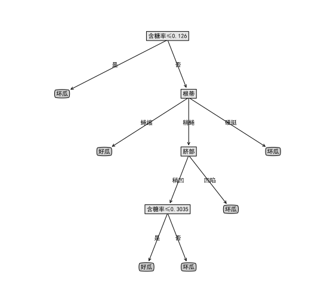

# Decision Tree
## Question
Implement a decision tree algorithm based on C4.5 to select the optimal splitting attribute using Python. Then, generate a decision tree for the dataset after removing the "density" attribute and the watermelon with ID 9 from Table 4.3 in the Watermelon dataset 3.0.

试用Python编程实现基于C4.5决策树算法来进行最优划分属性选择的决策树，并为表4.3西瓜数据集3.0中去掉“密度属性和编号为9的西瓜”以后的数据生成一棵决策树。

## Answer
