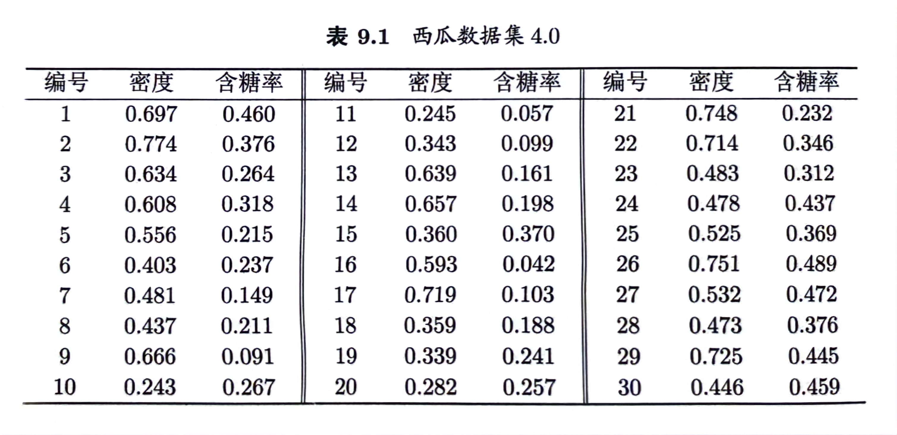
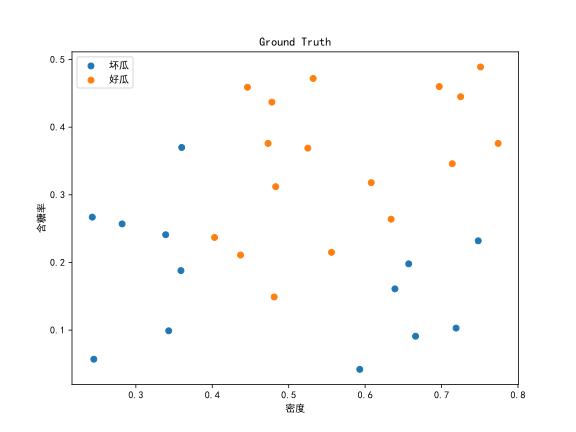
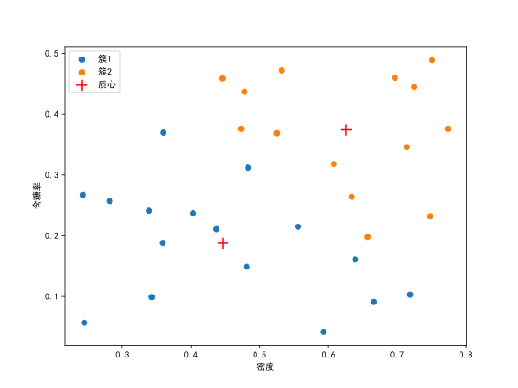
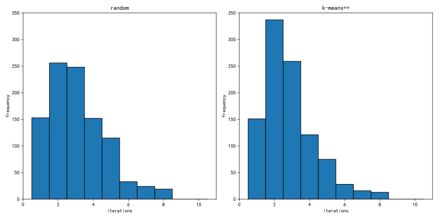
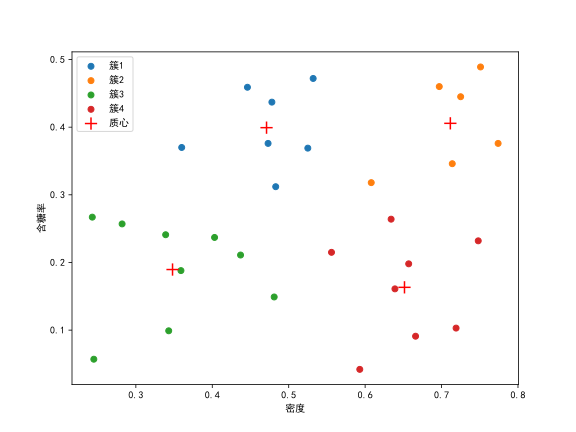
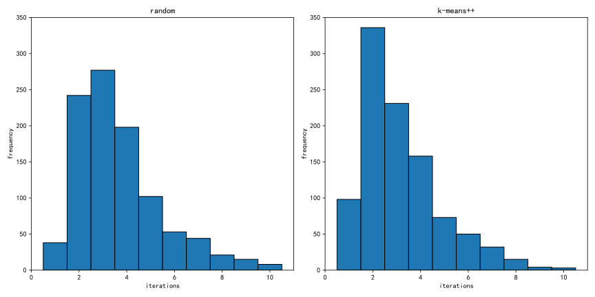

# K-Means
## Question
Given $k=2$ , try to design an improved k-means algorithm that can automatically determine the initial clustering centers. The requirement is that the number of iterations of the improved algorithm when the clustering process converges should not be greater than the situation when the initial clustering centers are randomly selected. Implement and demonstrate the improvement effect on the Watermelon Dataset 4.0.

给定 $k=2$ ，试设计一个能自动确定初始聚类中心的改进 k 均值算法，要求聚类过程收敛时改进算法迭代的次数不大于随机选择初始聚类中心时的情形。在西瓜数据集4.0上编程实现并展示改进效果。

## Answer
Ground Truth:

For $k=2$:

1000 times of experiments:
| Algorithm | Time Cost (s) | Average Iteration |
| --------- | ------------- | ----------------- |
| Random    | 0.35          | 3.11              |
| K-Means++ | 0.39          | 2.85              |

For $k=4$:

1000 times of experiments:
| Algorithm | Time Cost (s) | Average Iteration |
| --------- | ------------- | ----------------- |
| Random    | 0.49          | 3.69              |
| K-Means++ | 0.59          | 3.17              |

