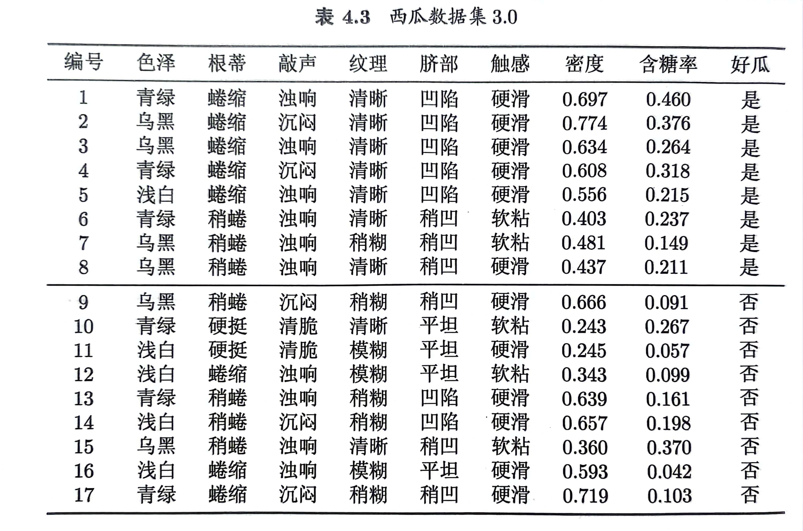
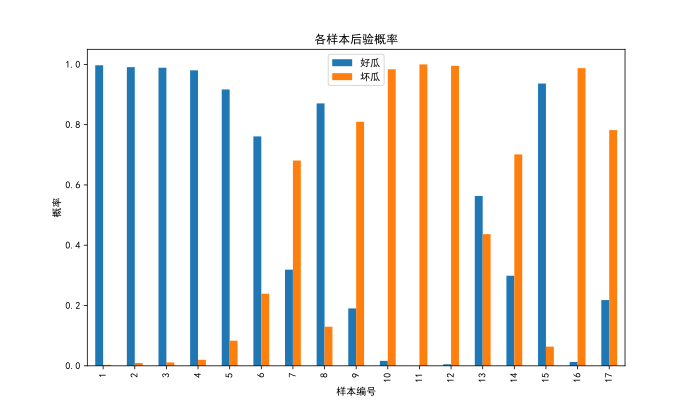

# Naïve Bayes
## Question
Implement a Naïve Bayes classifier with Laplace smoothing using Python, and use the Watermelon Dataset 3.0 as the training set to determine the class of the following 'test n' samples.

试用Python编程实现拉普拉斯修正的朴素贝叶斯分类器，并以西瓜数据集3.0为训练集，对下面“测n”样本进行类别判定。

| 编号 | 色泽 | 根蒂 | 敲声 | 纹理 | 脐部 | 触感 | 密度  | 含糖率 | 好瓜 |
| ---- | ---- | ---- | ---- | ---- | ---- | ---- | ---- | ------ | ---- |
| 测n  | 乌黑 | 稍蜷 | 浊响 | 清晰 | 稍凹 | 软粘 | 0.361 | 0.371  | ？   |

## Answer
